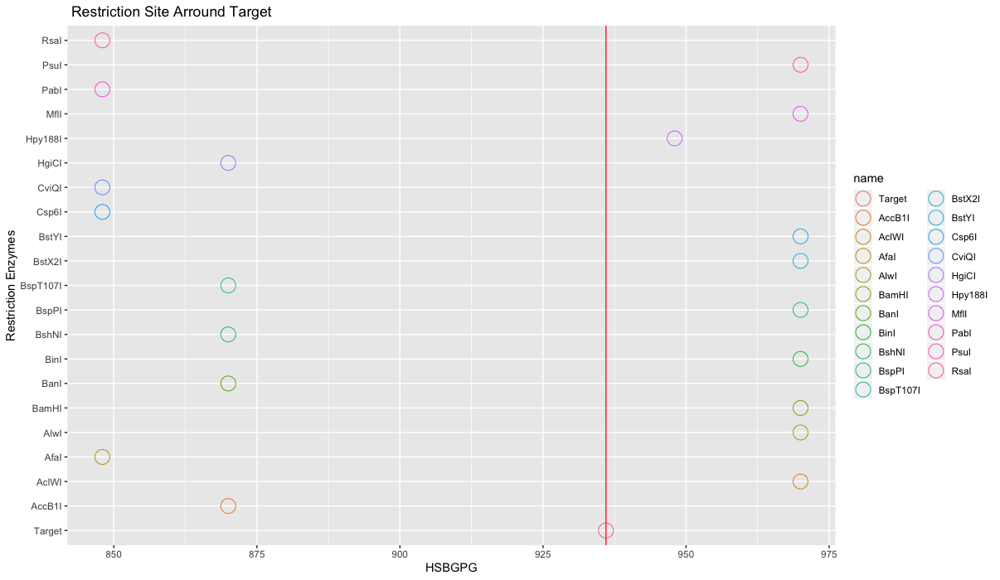

<!-- README.md is generated from README.Rmd. Please edit that file -->

# rsrm

<!-- badges: start -->

<!-- badges: end -->

## Description

The goal of rsrm is to generate the distribution of Restriction Sites on
given DNA sequence and also construct the Restriction Map with given
single and double digests reaction result.

## Installation

You can install the development version from
[GitHub](https://github.com/) with:

``` r
# install.packages("devtools")
require("devtools")
install_github("LoadingBFX/rsrm", build_vignettes = TRUE)
library("rsrm")
```

To run the shinyApp:

``` r
runRsrmApp()
```

## Overview

``` r
browseVignettes("rsrm")
```

  - rsrm stands for Restriction Site and Restriction Map. The package
    contains 2 functions will help you to generate the distribution of
    RS on given DNA sequence and also construct the RM with given single
    and double digests reaction result. Also there is a shinyApp for
    function `findre()`, run the Shiny app by

<!-- end list -->

``` r
runRsrmApp()
```

  - First function of rsrm package is RS. Locating the restriction sites
    around target sequnce.
      - `findre()` will find all of the positions can be cut by the
        enzymes in dataset. You can set the number of enzymes to display
        in the plot. Default value is 6, which means 6 enzymes will be
        displayed on the plot for both side of target sequence (totally
        12 sites, 6 for left, 6 for right, 1 for target, if there are
        enough sites.).
        example:
        
        ``` r
        seq1 <- 'GGCAGATTCCCCCTAACGTCGGACCCGCCCGCACCATGGTCAGGCATGCCCCTCCTCATCGCTGGGCACAGCCCAGAGGGT
        ATAAACAGTGCTGGAGGCTGGCGGGGCAGGCCAGCTGAGTCCTGAGCAGCAGCCCAGCGCAGCCACCGAGACACC
        ATGAGAGCCCTCACACTCCTCGCCCTATTGGCCCTGGCCGCACTTTGCATCGCTGGCCAGGCAGGTGAGTGCCCC'
        name1 <- 'Example gene for test findre (EGFTF)'
        seq2 <- 'ACGTCG'
        name2 <- 'Target'
        result <- findre(name1, seq1, name2, seq2)
        result
        ```
        
        
  - Second function is to construct RM for unknown sequence which is
    also useful for DNA Sequencing.
      - Everyone who took BCH Course must has see this kind of question
        on
            exam
        
            Unknown sequence and fragment obtained in single and double digests reaction were:
            EcoRI: 70, 30kb
            HaeIII: 60, 40kb
            EcoRI + HaeIII: 40, 30, 20, 10kb
            Q: construct a restriction map of unknown sequence.
        
        Now you can easily put single and double digests reaction result
        in `rsmap()` function to construct thr RM for you
        
        ``` r
        frag1 <- c(70, 30)
        frag2 <- c(60, 40)
        dou_dig <- c(40, 30, 20, 10)
        enz1 <- "EcoRI"
        enz2 <- "HaeIII"
        rsmap(enz1, frag1, enz2, frag2, dou_dig)
        ```
        
        

## Contributions

``` r
library("rsrm")
lsf.str("package:rsrm")
```

The author of the package is Fanxing Bu. sanitizeSeq() is adapted from
Dr. Steipe’s function dbSanitizeSequence() in course BCH441 ABC-units.
It has been indicated and referenced in the utility.R file. The rest
functions were authored by Fanxing.

## References

Scrucca L., Fop M., Murphy T. B. and Raftery A. E. (2016) mclust 5:
clustering, classification and density estimation using Gaussian finite
mixture models The R Journal 8/1, pp. 205-233
<https://cran.r-project.org/web/packages/mclust/vignettes/mclust.html>

Boris Steipe BCH441 - Bioinformatics
<http://steipe.biochemistry.utoronto.ca/abc/index.php/Bioinformatics_Main_Page>

## Acknowledgements

This package was developed as part of an assessment for 2019 BCB410H:
Applied Bioinformatics, University of Toronto, Toronto, CANADA.
