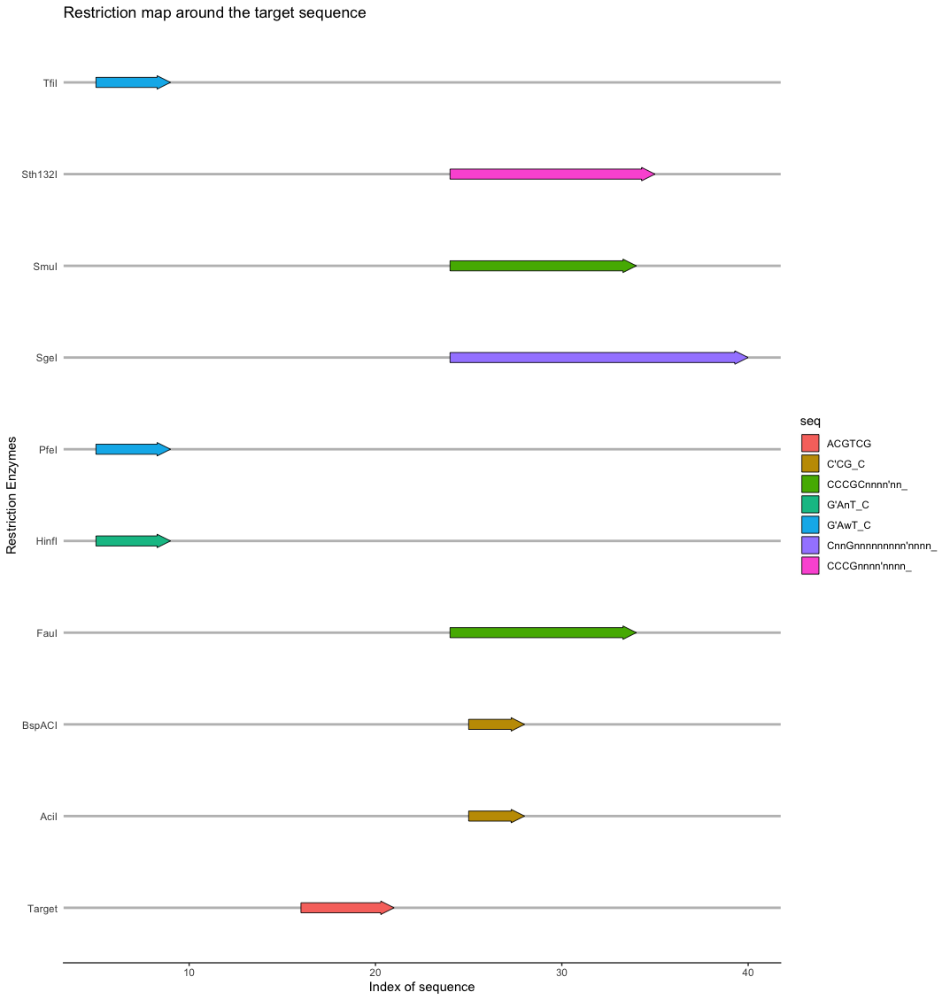
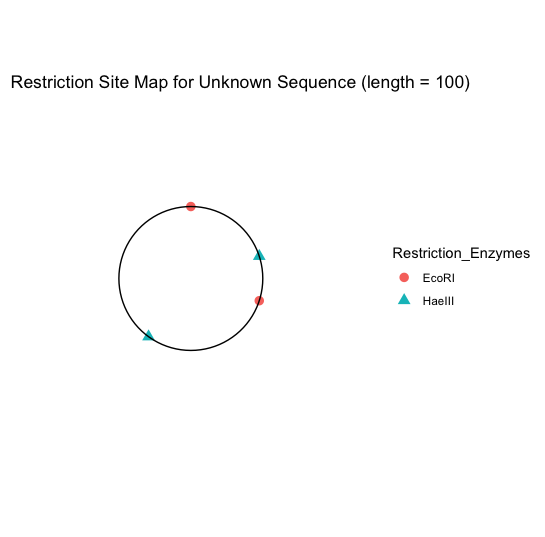

# rsrm

<!-- badges: start -->
<!-- badges: end -->

The goal of rsrm is to locating restriction sites around target sequnce and construct restriction map.

## Installation

You can install the released version of rsrm from GitHub with:

``` r
require("devtools")
install_github("LoadingBFX/rsrm")
library("rsrm")
```
## Overview
* rsrm stands for Restriction Site and Restriction Map. This will help you to generate the distribution of RS on given DNA sequence and also construct the RM with given single and double digests reaction result.

* First function of rsrm package is RS. Locating the restriction sites around target sequnce.
  + ```findre()``` will take FASTA files and enzyme dataset as input and output all of the positions can be cut by the enzymes in dataset.
  + ```rsplot()``` can visualize the result of ```findre()```.
    + You can set the number of enzymes to display in the plot. Default value is 10, which means 10 enzymes will be displayed on the plot for both side of target sequence (totally 21 points, 10 for left, 10 for right, 1 for target). The number don't be larger than 30.
    example:
    ```r
    rsplot(fas_file_for_dna, fas_file_for_target, 10)
    ```
    
    
* Second function is to construct RM for unknown sequence
  + Everyone who took BCH Course must has see this kind of question on exam
    ```
    Unknown sequence and fragment obtained in single and double digests reaction were:
    EcoRI: 70, 30kb
    HaeIII: 60, 40kb
    EcoRI + HaeIII: 40, 30, 20, 10kb
    Q: construct a restriction map of unknown sequence.
    ```
    Now you can easily put single and double digests reaction result in ```rsmap()``` function to construct thr RM for     you
    ```r
    frag1 <- c(70, 30)
    frag2 <- c(60, 40)
    dou_dig <- c(40, 30, 20, 10)
    enz1 <- "EcoRI"
    enz2 <- "HaeIII"
    rsmap(enz1, frag1, enz2, frag2, dou_dig)
    ```
    

## Contributions

The author of the package is Fanxing Bu. The functions available within this 
package include:

-```buildfas```

-```cutpos```

-```findre```

-```rsmap```

-```rsplot```

All of the function was authored by Fanxing Bu, The packages used to implement these functions are clearly indicated in description file. The built-in restriction enzymes dataset are from http://rebase.neb.com.

The function ```buildfas``` is basically equivalent to ```seqinr::write.fasta```, I implement it for user to create their fasta file more convenient.  ```cutpos``` is a function to find the cut position of single restriction enzyme. It is a helper function for ```findre``` and also useful when you exactly know which enzyme you want to use. ```rsmap``` and ```rsplot``` are both depend on ggplot2.
